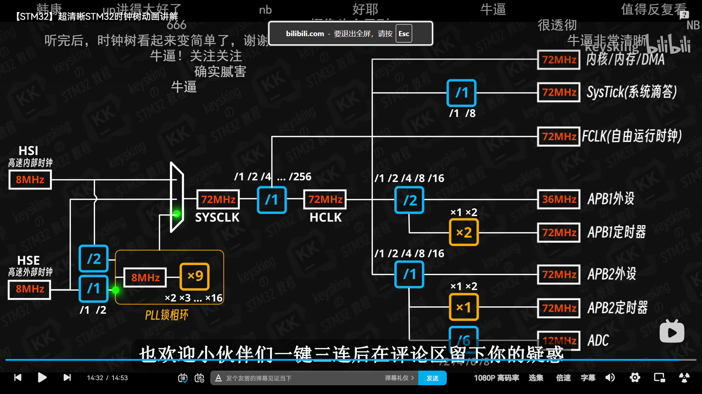

## 1 基础知识
### 1.1 STM32 简介
1. ST 公司全称是意法半导体。其中的 S 和 T 分别指的是意大利和法国某个公司的首字母，着两家公司合并后，于是组合成 ST 公司；
2. STM32 系列命名规则。以课程中使用的 STM32F103C8T6 为例，其中 ST 指的是 ST 公司，M 指的是微控制器，32 指的是 32 位机器数，F 指的是主流型号（主要有五大产品类型号），103 指的是产品子系列号，C 指的是 48 引脚，8 指的是 64kB 的闪存存储器，T 指的是 LQFP 封装技术，6 指的是 -40~85 摄氏度的工作温度；  

### 1.2 STM32 基本模块  
1. 由四个驱动（主动）单元和四个被动单元组成主系统；
2. 其中驱动单元 DCode、System 总线、DMA1 和 DMA2;
3. ICode 总线不作为驱动单元原因是 ICode 总线不会主动发起总线事务请求，且不参与总线事务仲裁；
4. DCdoe 和 System 总线在接收到内核请求后，可以在合适时机**主动**发起总线事务请求；
5. 其中被动单元有 SRAM、Flash、FSMC 和 AHB 到 APB 的数据通路以及相连的外设；
6. 为解决 STM32 内、外存容量小的问题，特意设置 FSMC 供扩展外部存储；
7. 时钟外设（RCC）连接在 AHB 上；
8. AHB 分出 APB1 和 APB2，其最高主频分别为 36MHz 和 72 MHz；

## 2 程序烧录和执行过程
### 2.1 烧录过程
1. 《STM32 入门教程》中使用的都是通过 SWDIO 来烧录程序；
2. 当 BOOT1 和 BOOT0 都置 0 时，自动用主闪存启动程序；
3. 当 BOOT1 和 BOOT0 分别置 0 和 1 时，使用系统存储器来启动程序；
4. 系统存储器中写入了内嵌的自主程序，当进入该区域时，会自动地接受 SWDIO 传入的程序，并将其写入主闪存中；  

### 2.2 执行过程
1. 将所有的寄存器复位，并锁住启动模式；
2. 进入 0x00000000 地址获取程序入口；
3. 注意 0x00000000 是由主闪存起始地址映射过去的；
4. 从 0x00000004 地址读取复位向量（程序入口地址）；
5. 获取中断向量表后，将程序映射至 SRAM 中；
6. 配置系统时钟，并初始化各种外设；
7. 进入 main 函数。  

## 3 基本外设
### 3.1 GPIO
1. 首先明白 GPIO 内部有两个 MOS 管来控制高、低电平和高阻态；
2. 推挽输出就是上方 MOS 开，下方 MOS 关，以达到推的效果。然后上方 MOS 管关，下方MOS 管开，以达到挽的效果；
3. 开漏输出中上方 MOS 管均是关闭状态，但是根据下方 MOS 管的开关来输出高低电平；
4. 值得注意的是，开漏输出往往需要一个外部的上拉电阻，只有这样才能输出高电平；
5. 使用开漏输出的原因是，外设的标准电压和 GPIO 输出的差距过大，或者是在某些情况下推挽输出会导致短路；
6. 在使用 GPIO 外设之前，需要在代码中配置好。比如先开启 GPIO 的时钟、引脚和输出模式等等；

### 3.2 时钟
1. 时钟可以看作是整个微控制器的心脏，由它来调控各个器件的运行；
2. 时钟的作用是屏蔽物理上电脉冲不一致的问题，以保证器件的正常运行；
3. 时钟树是整个时钟的具体体现；
4. 时钟树中最根本的两个时钟是高速内部时钟（HSI）和高速外部时钟（HSE）；
5. 通过倍频器和预分频器将原有的时钟频率变成器件所需要的频率；
6. 在 STM32 进入省电模式时，需要关闭大部分费电的时钟，保留自由运行时钟（FCLK）来确保中断外设的正常运行；

### 3.3 EXTI
1. 嵌套向量中断控制器（NVIC）是紧紧靠着内核的，所有的中断都要到这里，才能被内核感知；
2. 外部中断事件控制器（EXTI）主要感知外部中断，然后再将信号传给 NVIC，最终中断才能被内核处理；
3. 外部中断和内部中断不同的是，外部中断可以在 EXTI 中配置优先级；
4. 若同时有多个中断来临时，先看抢占优先级，再看响应优先级；
5. 外部中断必须开启AFIO的时钟，即要开启复用的 IO 口；

### 3.4 TIM
1. 定时器中最基本的单元是**时基单元**；
2. 时基单元由计数器、预分频器、自动重装载寄存器组成的；
3. 预分频器有影子寄存器；
4. 预分频器本身也是一个计数器；
5. 通用定时器对于基础定时器而言，新增了 4 通道输入输出能力，核心实现 PWM 输出、输入捕获、编码器接口三大高频功能；  

### 3.5 ADC
1. 利用二分法来测量外设的输入电压；
2. 将测量好的输入电压以二进制的方式存储起来；
3. ADC 的电压测量范围是 0-3.3v；

### 3.6 DMA
1. 全称是直接内存访问控制器；
2. 每次可以大批量的读取内存，且可以不需要使用中断；
3. STM32 中 DMA 和 CPU 的占有总线是靠轮询的方式；

### 3.7 实时时钟
1. 本质上是一个计数器，但是它是从 1970 年开始计数的计数器；
2. 一般实时时钟使用 LSE 晶振作为时钟；
3. MCU 内部一般有一颗纽扣电池，在外部掉电时开启使用；

### 3.8 看门狗
1. 防止程序卡死等意外情况，来设置看门狗；
2. 需要定时喂狗，如果没有定时喂狗，那么就自动复位程序；

### 3.9 电源控制
1. 低功耗模式有三种，分别是睡眠模式、停机模式和待机模式；
2. 睡眠模式会被任意事件或中断打破，而停机模式需要外部中断，最后是待机模式需要特定的信号才能被打破；
3. 睡眠模式只关闭 CPU 的时钟，其他外设的时钟不关闭；
4. 停机模式和待机模式会将内部时钟关闭，只留下必须的时钟；

### 3.10 FLASH
1. 主要有读快写慢和按页写的特点；
2. 数据掉电不易失；
3. 如何写主要是靠 FLASH 接口控制；

## 4 通信协议  
### 4.1 USART 协议
1. 一般来说，只会使用 USART 的异步模式，即不需要时钟线；
2. 依靠帧格式来定界，起始位为低电平，停止位为高电平，帧之间时钟处于高电平；
3. 全双工工作，有两根数据线，一条接收，一条发送；
4. 最常用的串口协议；

### 4.2 I2C 协议
1. 设计目的只要是用于内部低速设备使用的，同时因为其结构原因，决定了传输效率低；
2. 半双工运行，所以只有一条数据线 SDA，又因为是同步传输协议，所以还有一条时钟线 SCL；
3. 由于要满足多主多从模式，所以采用开漏输出模式；
4. 开始信号是，在 SCL 高电平时，SDA 从高电平拉低；
5. 结束信号是，在 SCL 高电平时，SDA 从低电平拉高；
6. 通信需要有地址，且有应答机制，整体类似计算机网络中的数据链路层；

### 4.3 SPI 协议
1. 物理层核心是 4 根线（SCK+MOSI+MISO+NSS），主从架构靠 NSS 片选，全双工传输效率高；
2. 和 IIC 不同的是，SPI 不对硬件资源进行压榨式的使用，而是尽可能地使通信变得简单；
3. SPI 的通信速度是这三种协议中速度最快的；

